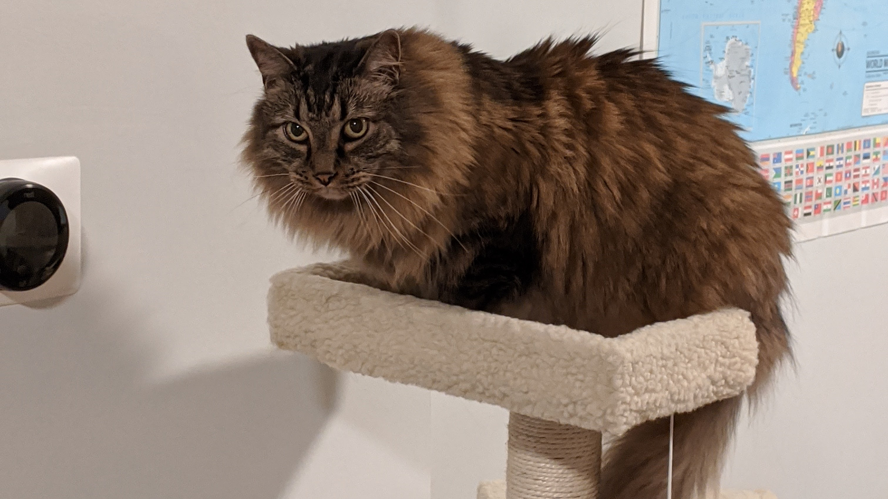

# About

Hi, I'm Steph Mallamaci (mah-lah-mah-chee). I'm a software developer who works mostly on the web and web-adjacent things. I've been muckin' around on computers since I was young, but these days I work at Tempus Labs.

I received my bachelor's degree in Computer Science from Miami Univerity (in Ohio) in 2018.

I currently live in Chicago, IL, with my wonderful cat Oswald. He's a **very very good boy.**

While you're on my site, [check out some of my side-projects](/side-projects) that I have been working on.

